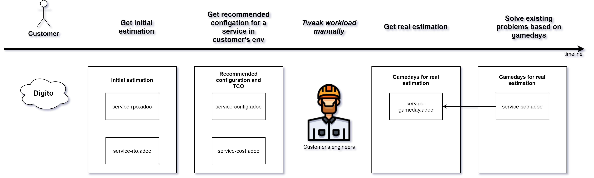

# Table of Contents  
1. [Digito Failure Injection Documents](#digito-failure-injection-documents) 
2. [Contributing To This Package](#contributing-to-this-package)
   1. [Package Organization](#package-organization)
   2. [Adding New Document](#adding-new-document)
   3. [Metadata File](#metadata-file)
   4. [Adding New Python Script](#adding-new-python-script)
   5. [Including python script in SSM documents](#including-python-script-in-ssm-documents)
   6. [SSM automation execution output](#ssm-automation-execution-output)
   7. [Rollback support](#rollback-support)
   8. [Adding recommended alarms](#adding-recommended-alarms)
   9. [Parameters in SSM document](#parameters-in-ssm-document)
  10. [SyntheticAlarmName](#synthetic-alarm-name)
  11. [RecoveryTime/RecoveryPoint](#recovery-time-recovery-point)
  12. [Risk classification](#risk-classification)
3. [Build validation](#build-validation)
   1. [Unit tests](#unit-tests)
   2. [Code Style](#code-style)
4. [Integration Tests](#integration-tests)
    1. [Pool Size Configuration](#pool-size-configuration)
    2. [Cloud Formation Templates](#cloud-formation-templates)
    3. [Pytest Integration with Resource Pooling](#pytest-integration-with-resource-pooling)
    4. [Common Given Steps for Cloud Formation Template](#common-given-steps-for-cloud-formation-template)
        1. [Common Step To Define Test Resources](#common-step-to-define-test-resources)
        2. [Common step to execute SSM automation](#common-step-to-execute-ssm-automation)
        3. [Common step to verify SSM  execution result](#common-step-to-verify-ssm-execution-result)
    5. [Scenario Input Parameters](#scenario-input-parameters)
        1. [CFN Parameter References](#cfn-parameter-references)
        2. [Cache Parameter References](#cache-parameter-references)
        3. [Simple Parameters](#simple-parameters)
    6. [Tests Isolation](#tests-isolation)
    7. [Integration Test Execution](#integration-test-execution) 
5. [Design.md writing guidelines](#design.md-writing-guidelines) 
5. [TODO List](#todo-list)

# Digito Failure Injection Documents
This package provides SSM documents for injecting failures in different aws resources.

# Publishing Documents
* Use below command to publish all documents in us-west-2 region to your account. Needs python3.6 or later
python3.8 publisher/src/publish_documents.py --region us-west-2

* Use below command to publish limited number of documents in different file. We will provide this file during
  recommendations for relevant test documents
python3.8 publisher/src/publish_documents.py --region us-west-2 --file-name ec2-manifest --log-level INFO

* Setting up automated publish to account
  TBD. Setup CodeBuild process for publishing documents automatically to account when there is a change

* What does publisher do?
** Gets list of documents to publish based on manifest file.
** Replace script_placeholder in ssm documents with script code.
** Check documents which have changed and create or update document as needed to publish.

# Contributing To This Package
## Package Organization
* documents/<resource_type> -- This folder contains ssm automation documents which can be used directly in Digito to run test. Each service
  will have a separate folder for its test documents.
* documents/util -- This folder contains ssm documents(both command and automation) and python scripts used by ssm documents which are helpers
  for test SSM documents. These documents do not run test on their own.
* documents/util/scripts -- This folder contains python scripts used by ssm documents to setup or run tests.
* publisher -- This folder contains python scripts to validate and publish ssm documents required in account.
* resource_manager -- contains mechanisms to manage integration tests resources for SSM automation integration testing framework

## Adding New Document
* Test Document -- Test documents need to be automation document only. Add test documents to documents/test/<service> folder.
  Each folder would contain the Design, Documents and Test folder. Design would specify the input, output and permission needed
   for document. Documents folder contains the document and metadata.json file about the document.
* Util Documents -- Util documents can be either command or automation document. It would have same folder hierarchy and
 requirements as Test document above.

## Metadata File
Example:
````
{
  "displayName": "Test - Inject Memory load to ASG",
  "documentName": "Digito-SimulateHighMemoryLoadInAsg_2020-07-28",
  "documentType": "Automation",
  "documentContentPath": "AutomationDocument.yml",
  "documentFormat": "YAML",
  "dependsOn": "Digito-RunMemoryStress_2020-07-28,Digito-KillStressCommand_2020-07-28",
  "tag": "compute:test:ec2-inject_memory_load:2020-07-28",
  "failureType": "HARDWARE",
  "risk": "SMALL",
  "details": {
      "1": "Figure out the amount of memory to grab from available free memory.",
      "2": "Start a memory load for the amount of memory in bytes on instance for X minutes.",
      "3": "Verify alarm (a) is triggered."
  },
  "recommendedAlarms": {
      "MemoryUtilizationAlarmName": "compute:alarm:ec2-memory-util:2020-07-13"
  },
  "minorVersion": "001"
}
````
<b>File location:</b>.../AwsDigitoArtifactsGameday/documents/compute/test/ec2-inject_memory_load/2020-07-28/Documents/metadata.json

* displayName - [Required] SSM display name, free text. 
* documentName - [Required] SSM automation document name with major version, major version should correspond to date added to tag.
* documentType - [Required] Command or Automation
* documentContentPath - [Required] Document file name
* assumeRoleCfnPath - [Required] AssumeRole CFN path
* documentFormat - [Required] YAML or JSON
* dependsOn - [Optional] Add other documents that this document requires.
* tag - [Required] reference to specification of automation document
* failureType - [Required] Failure type, valid values: SOFTWARE/HARDWARE/AZ/REGION
* risk - [Required] Risk, valid values: SMALL/MEDIUM/HIGH
* details - [Required] Steps which should be performed in SSM document 
* recommendedAlarms - [Optional] Map of SSM alarm input parameter name and reference to recommended alarm
* minorVersion - [Required] minor version of document (should be increased every time plan to commit a change).

## Adding New Python Script
* Install requirements by running 'python3.8 -m pip install -r requirements.txt'
* Add new scripts to documents/util/scripts/src folder and corresponding unit test to documents/util/scripts/test
* Run unit tests by running 'coverage run setup.py test'
* Look at test coverage report by running 'coverage report -m' and detailed report by running 'coverage html'

## Including python script in SSM documents
* Check documents/rds/test/force_aurora_failover/2020-04-01/Documents/AutomationDocument.yml for an example of how to include script in SSM document.
```
Script: |-
  SCRIPT_PLACEHOLDER::rds_util.imports

  SCRIPT_PLACEHOLDER::rds_util.get_cluster_writer_id
```

## SSM automation execution output
* Only include outputs like RecoveryTime, RecoveryPoint in top level execution output for SOP documents.
* Other outputs are already part of step outputs.
* Not needed for test ssm documents.

## Rollback support
* Rollback is needed where we may leave application in bad state, for example when we changed security group of resource.
* It is not needed in cases which can't be rolled back like when ec2 instances are terminated.
* It should not be added for SOP documents. We would want to pause SOP where it failed.
* In normal execution, rollback would be executed after current execution is completed.
* In interrupt scenario, previous execution is stopped and new execution is started in rollback mode.
* Add 2 optional parameters IsRollback and PreviousExecutionId
* Execution should branch based on IsRollback
* Example : documents/compute/test/ec2-network_unavailable/2020-07-23/Documents/AutomationDocument.yml
* Please include rollback test in cucumber too with following steps, example: documents/compute/test/ec2-network_unavailable/2020-07-23/Tests/features/ec2_network_unavailable.feature -
```
Start execution in normal mode
stop it when it is in a given step
Start execution in rollback mode passing previous execution id and isRollback true
```

## Adding recommended alarms
Add similar to below in metadata.json to connect recommended alarm to ssm document parameter. Example, 

DdbReadThrottledAlarmName - SSM document parameter
dynamodb:alarm:health-read_throttle_events:2020-04-01 - Reference id for recommended alarm
```
"recommendedAlarms": {
    "DdbReadThrottledAlarmName": "dynamodb:alarm:health-read_throttle_events:2020-04-01"
}
```

Also add "ssm:GetParameters" permission in AutomationAssumeRoleTemplate.yml for documents with recommended alarms.

Tests with recommended alarms would have following three mandatory steps. See documents/compute/test/asg-network_unavailable/2020-07-23/Documents/AutomationDocument.yml for example.
* AssertAlarmToBeGreenBeforeTest - This should be first step before we start execution
* AssertAlarmTriggered - This should be validated after injecting failure that alarm triggered during test.
* AssertAlarmToBeGreen - This should be validated after the test is over that alarm is green again.

## Parameters in SSM document
* Try to keep only main resource in ssm document parameter and resolve other resources needed in document.
* For example, figure out security group or vpc id from lambda arn instead of taking another parameter from users.
* Other parameters like TestDuration, AlarmWaitTime etc should have a default value based what is appropriate for the document.
* AutomationAssumeRole should be a required parameter in all documents.

## SyntheticAlarmName
* Synthetic alarm is an alarm that are at application level health while other alarm parameters would be recommended
 for specific resources like cpu utilization for RDS instance(See adding recommended alarms). This should be green after each test.
* Add a validation that Synthetic alarm is green after rollback is performed or test ends within expected recovery time. Expected recovery time depends on test.

## RecoveryTime/RecoveryPoint
* Add RecoveryTime for every SOP SSM document by starting a timer at start of document. Name of execution output should be RecoveryTime.
* Where applicable, add recovery point too. For example, for point in time restore, use latest restorable time to calculate it. For restore from backup, use last backup time.
* Use scripts in documents/util/scripts/src/common_util.py to record recovery time.

## Risk classification
* low -  we don’t expect any outage because of redundancy setup of the resource, for example rebooting one instance in ASG
* medium - can create outage if application code can not handle temp restart like rebooting db
* high - will create outage for more than x minutes like network outage or the sqs queue policy changes to disable permission

# Build validation
## Unit tests
* Run 'python3 -m pytest -m unit_test' to run all unit tests before sending PR's.

## Code Style
* Run 'python3 -m flake8' to validate code style. Check setup.cfg for flake8 rules/overrides.


# Integration Tests
* In order to verify SSM automation document validity we want to have way to test documents against real AWS resources. 
* To make tests human readable we are using [pytest-bdd](https://pypi.org/project/pytest-bdd/) for test scenario definition. 
* To manage integration test AWS resources we are using "Resource Pooling" approach based on CloudFormation (CFN) templates. In which case CFN template becomes definition of resources and "Resource Polling" mechanism manages resources lifecycle and pool size.
* "Resource Pooling" implementation is located under '.../AwsDigitoArtifactsGameday/resource_manager/' folder.

## Pool Size Configuration
Configuration based on cloud formation template names mapped to number which represents limit of copies of cloud formation stacks Resource Pool can contain. 

<b>ON_DEMAND</b> type of CFN template resource:
* If running 3 tests in parallel which are using resources defined in template “RdsAuroraFailoverTestTemplate” maximum 3 cloud formation stack copies will be created for given template. 
* If running 5 or more tests in parallel which are using resources defined in template “RdsAuroraFailoverTestTemplate” maximum 3 cloud formation stack copies will be created for given template. 
* If running 1 test which is using resources defined in template “RdsAuroraFailoverTestTemplate” only 1 cloud formation stack copy will be created for given template. 
<b>NOTE:</b> only one test at a time will use one stack resource. So that there will be no cases when multiple tests are manipulating same resources (AWS services).
```
Given the cloud formation templates as integration test resources
      |CfnTemplatePath                                                                                |ResourceType|DBInstanceClass|AllocatedStorage|
      |documents/rds/test/force_aurora_failover/2020-04-01/Documents/AutomationAssumeRoleTemplate.yml | ASSUME_ROLE|               |                |
```
<b>File location:</b>.../AwsDigitoArtifactsGameday/documents/rds/test/force_aurora_failover/2020-04-01/Tests/features/aurora_failover_cluster.feature

<b>ASSUME_ROLE</b> type of CFN template resource:
* Only single copy of stack will be created which will contain all assume roles CFN templates given in test scenario. 
* Here is not risk of that multiple tests will use same assume role stack. It is ok if multiple tests will use same ASSUME_ROLE at the same time (No need isolation).
```
Given the cloud formation templates as integration test resources
      |CfnTemplatePath                                                                                |ResourceType|DBInstanceClass|AllocatedStorage|
      |resource_manager/cloud_formation_templates/RdsAuroraFailoverTestTemplate.yml                   |   ON_DEMAND|    db.t3.small|               1|
```
<b>File location:</b>.../AwsDigitoArtifactsGameday/documents/rds/test/force_aurora_failover/2020-04-01/Tests/features/aurora_failover_cluster.feature

Pool size configuration content given bellow:
```
"""
Static cloud formation template path for assume roles. We want to combine all 
defined roles into single template.Reason - reduce number of CFN stacks 
to be deployed to avoid reaching a limit of CFN stacks.
NOTE: DO NOT CHANGE IT!
"""
ssm_assume_role_cfn_s3_path = 'resource_manager/cloud_formation_templates/AutomationAssumeRoleTemplate.yml'

"""
  The cloud formation template pool size limit configuration. It is represented 
  as a KEY=VALUE pair. In which case:\n
  KEY - is cloud formation template name (with no extension), template 
  name should be unique\n
  VALUE - is number of template cloud formation stack copies should be 
  presented before test execution\n
  NOTE: For SSM 'ASSUME_ROLE' templates we don't need to specify 
  pool size, it is using default\n 
  (multiple SSM documents can use same role at the same time)
"""
pool_size = dict(
   # In case if template name is not listed default pool size applied   
   default=1,  
   # The pool size configuration for RdsAuroraFailoverTestTemplate.yml 
   # (file name with no extension)   
   RdsAuroraFailoverTestTemplate=5
)
```
<b>File location:</b> .../AwsDigitoArtifactsGameday/resource_manager/config.py

## Cloud Formation Templates

Cloud Formation templates which are used for SSM automation documents integration tests as a resources should have unique name and located under following folder:
.../AwsDigitoArtifactsGameday/resource_manager/cloud_formation_templates

## Pytest Integration with Resource Pooling

To integrate Resource Manager with pytest we are using following file (more about pytest [fixtures](https://pytest-bdd.readthedocs.io/en/stable/#reusing-fixtures) and [hooks](https://docs.pytest.org/en/stable/reference.html#hooks)):
.../AwsDigitoArtifactsGameday/conftest.py  This file contains hooks and fixtures to manage cloud formation resources. 

## Common Given Steps for Cloud Formation Template

Point of having these steps as a common steps is to allow them to be reused as SSM automation integration tests. Tests resources are all based on cloud formation. But if here will be some other cases test owner can customize this step the way he need by writing his own version in test implementation. 
Common steps implementation are located in:.../AwsDigitoArtifactsGameday/conftest.py

### Common step to define test resources
Generic “given“ step implementation which defines resources to be used by integration test scenario for passed parameters. This step is interacting with resource manager and store cloud formation template,  input parameters into resource manager. Those parameters will be used during SSM automation document execution to pull resources. 

```
@given(parsers.parse('the cloud formation templates as integration test resources\n{cfn_input_parameters}'))
def set_up_cfn_template_resources(resource_manager, cfn_input_parameters):
    """
    Common step to specify cloud formation template with parameters for specific test. It can be reused with no
    need to define this step implementation for every test. However it should be mentioned in your feature file.
    Example you can find in: .../documents/rds/test/force_aurora_failover/Tests/features/aurora_failover_cluster.feature
    :param resource_manager: The resource manager which will take care of managing given template deployment and providing reosurces for tests
    :param cfn_input_parameters: The table of parameters as input for cloud formation template
    """
    for cfn_params_row in parse_str_table(cfn_input_parameters).rows:
        if cfn_params_row.get('CfnTemplatePath') is None or len(cfn_params_row.get('CfnTemplatePath')) < 1 \
                or cfn_params_row.get('ResourceType') is None or len(cfn_params_row.get('ResourceType')) < 1:
            raise Exception('Required parameters [CfnTemplatePath] and [ResourceType] should be presented.')
        cf_template_path = cfn_params_row.pop('CfnTemplatePath')
        resource_type = cfn_params_row.pop('ResourceType')
        cf_input_params = {}
        for key, value in cfn_params_row.items():
            if len(value) > 0:
                cf_input_params[key] = value
        rm_resource_type = ResourceManager.ResourceType.from_string(resource_type)
        resource_manager.add_cfn_template(cf_template_path, rm_resource_type, **cf_input_params)

```
<b>File location:</b>.../AwsDigitoArtifactsGameday/conftest.py

### Common step to execute SSM automation
Generic “given“ step implementation which executes SSM automation. Before execution it pulls available resources which will be used by SSM automation from resource manager [resource_manager.get_cfn_output_params()]. 
```
@given(parsers.parse('SSM automation document "{ssm_document_name}" executed\n{ssm_input_parameters}'), target_fixture='ssm_execution_id')
def execute_ssm_automation(ssm_document, ssm_document_name, resource_manager, ssm_test_cache, ssm_input_parameters):
    """
    Common step to execute SSM document. This step can be reused by multiple scenarios.
    :param ssm_document The SSM document object for SSM manipulation (mainly execution)
    :param ssm_document_name The SSM document name
    :param resource_manager The resource manager object to manipulate with testing resources
    :param ssm_test_cache The custom test cache
    :param ssm_input_parameters The SSM execution input parameters
    :return The SSM automation execution id
    """
    cfn_output = resource_manager.get_cfn_output_params()
    parameters = ssm_document.parse_input_parameters(cfn_output, ssm_test_cache, ssm_input_parameters)
    return ssm_document.execute(ssm_document_name, parameters)
```
<b>File location:</b>.../AwsDigitoArtifactsGameday/conftest.py

### Common step to verify SSM  execution result
Generic “given“ step implementation which waits for SSM automation completion by given execution id and expected execution state. 

```
@when(parsers.parse('SSM automation document "{ssm_document_name}" execution in status "{expected_status}"'))
def verify_ssm_automation_execution_in_status(ssm_document_name, expected_status, ssm_document, ssm_execution_id):
    """    
    Common step to wait for SSM document execution completion status. 
    This step can be reused by multiple scenarios.    
    :param ssm_document_name The SSM document name    
    :param expected_status The expected SSM document execution status    
    :param ssm_document The SSM document object for SSM manipulation (mainly execution)    
    :param ssm_execution_id The SSM document execution id to track    
    """    
    actual_status = ssm_document.wait_for_execution_completion(ssm_execution_id, ssm_document_name)
    assert expected_status == actual_status
```
<b>File location:</b>.../AwsDigitoArtifactsGameday/conftest.py

Test scenario example with common steps in this case will look like shown bellow:

* <b>Given</b> - step which is using generic implementation of “<b>Common step to define test resources</b>”
* <b>And</b> - step which is using generic implementation of “<b>Common step to execute SSM automation</b>”
* <b>When</b> - step which is using generic implementation of “<b>Common step to verify SSM  execution result</b>”

```
@rds @failover @integration
Feature: SSM automation document for Aurora cluster failover.
  Exercise RDS cluster failover using SSM automation document.

  Scenario: Create AWS resources using CloudFormation template and execute SSM automation document to failover RDS cluster with primary
    Given the cloud formation templates as integration test resources
      |CfnTemplatePath                                                                                |ResourceType|DBInstanceClass|AllocatedStorage|
      |resource_manager/cloud_formation_templates/RdsAuroraFailoverTestTemplate.yml                   |   ON_DEMAND|    db.t3.small|               1|
      |documents/rds/test/force_aurora_failover/2020-04-01/Documents/AutomationAssumeRoleTemplate.yml | ASSUME_ROLE|               |                |
    And cache DB cluster "dbReaderId" and "dbWriterId" "before" SSM automation execution
      |ClusterId                                             |
      |{{cfn-output:RdsAuroraFailoverTestTemplate>ClusterId}}|
    And SSM automation document "Digito-AuroraFailoverCluster" executed
      |ClusterId                                             |InstanceId                 |AutomationAssumeRole                                                             |SyntheticAlarmName                                             |
      |{{cfn-output:RdsAuroraFailoverTestTemplate>ClusterId}}|{{cache:before>dbReaderId}}|{{cfn-output:AutomationAssumeRoleTemplate>DigitoAuroraFailoverClusterAssumeRole}}|{{cfn-output:RdsAuroraFailoverTestTemplate>SyntheticAlarmName}}|

    When SSM automation document "Digito-AuroraFailoverCluster" execution in status "Success"
    And cache DB cluster "dbReaderId" and "dbWriterId" "after" SSM automation execution
      |ClusterId                                             |
      |{{cfn-output:RdsAuroraFailoverTestTemplate>ClusterId}}|

    Then assert DB cluster "dbReaderId" instance "before" failover became "dbWriterId" instance "after" failover
    And assert DB cluster "dbWriterId" instance "before" failover became "dbReaderId" instance "after" failover
```
<b>File location:</b> .../AwsDigitoArtifactsGameday/documents/rds/test/force_aurora_failover/2020-04-01/Tests/features/aurora_failover_cluster.feature

## Scenario Input Parameters 

A the moment we are supporting following parameters types:

* CFN parameter references (cfn-output)  - points to cloud formation output parameter values 
* Cache parameter references (cache) - points to cached parameter values
* Simple parameters - no reference, just a regular parameter value

### CFN Parameter References
Let’s assume that we want to execute SSM automation and SSM automation expects input parameter with name “ClusterId” to be passed. As well we have used cloud formation template with name “RdsAuroraFailoverTestTemplate” as test resources which contains Output with name “ClusterId”. In this case we can define reference which is going to point to “cfn-output” for given CFN template “RdsAuroraFailoverTestTemplate” and template output parameter with name “ClusterId” as shown bellow. 
<b>NOTE:</b> cfn-output parameters are populated when CFN test resources are available for test.
```
And SSM automation document "Digito-AuroraFailoverCluster" executed
  |ClusterId                                             |
  |{{cfn-output:RdsAuroraFailoverTestTemplate>ClusterId}}|
```
### Cache Parameter References
In order use cached parameter references that data should be cached at some point before fetching it. However same principal is used as with “cfn-output“ parameters except no template name, since it is completely up to a customer how data this case is going to be organized (keep in mind that cache data structure should be python [dictionary](https://docs.python.org/3/tutorial/datastructures.html#dictionaries)).
```
And SSM automation document "Digito-AuroraFailoverCluster" executed
    |InstanceId                 |
    |{{cache:before>dbReaderId}}|
```
### Simple Parameters
Simple parameter meaning is that we are not using any references to find value for given parameter reference. It is just regular value for given parameter. 
```
And SSM automation document "Digito-AuroraFailoverCluster" executed
    |InstanceId                  |
    |my-rds-instance-id-xxxx-2222|
```

## Tests Isolation
Usually when we write tests we don’t want to execute all tests to verify them. Instead we want to execute only those tests which we want. In this case test [markers](https://pytest-bdd.readthedocs.io/en/stable/#organizing-your-scenarios) can help. You can register your in following way:
```
[tool:pytest]
...
markers =
    rds    
    failover    
    integration
```
<b>File location:</b> .../AwsDigitoArtifactsGameday/setup.cfg

## Integration Test Execution 
This section explains test execution workflow and how cloud formation based resources are are created and provided for SSM automation document execution.

Integration test execution command line:
> python3.8 -m pytest -m integration --workers 2  --run_integration_tests --keep_test_resources --aws_profile my_aws_profile_name --pool_size TestTemplateA=5,TestTemplateB=3

* -m pytest - (Required) Use [pytest](https://docs.pytest.org/en/stable/) module for test execution.
* -m integration - (Optional) When here is a need to execute selected  tests by given [markers](https://pytest-bdd.readthedocs.io/en/stable/#organizing-your-scenarios). 
* --run_integration_tests (Required) - Required in case if running integration tests. This wll trigger creation AWS resources to support integration test framework: S3 bucket, DynamoDB table. 
* --keep_test_resources - (Optional) If specified created CFN resources should be kept after test execution. By default (if not specified) after test execution resources will be removed and DynamoDB table, S3 bucket will be removed. 
* --workers 2 - (Optional) Number of parallel processes. Supported by [pytest-parallel](https://pypi.org/project/pytest-parallel/).
* --aws_profile - (Optional) The name of [AWS profile](https://docs.aws.amazon.com/cli/latest/userguide/cli-configure-profiles.html)
* --pool_size - (Optional) Custom pool size for CFN template resources, it overrides configuration given resource_manager/src/config.py. NOTE: Once pool size increased there is no feature to decrease it for now (only manual deletion available.).

# Design.md writing guidelines
## High-level users flow



## Gameday guidelines
1. Must be capable to restore the state of changes from previous execution.
    1. Use parameters with standard naming and description:
        * `PreviousExecutionId`
        * `IsRollback`
1. The `Backup<WhatsGoingToBeBackedUp>ConfigurationAndInputs` step must:
    1. Backup the current state of services under change
    1. Backup input parameters (e.g. `LambdaArn`, `ApiGatewayId`, `StageName`, and etc.)
1. The `RollbackPreviousExecution` (when `IsRollback` is True) step must:
    1. Take saved parameters from previous execution from  `Backup<WhatsGoingToBeBackedUp>ConfigurationAndInputs` step
    1. Compare the *previous parameters* with the *current given parameters* and throw an error if those are not equal. Node: you need to compare parameters that identify services themselves. Example is `LambdaArn`, `ApiGatewayId`, `SqsQueueUrl`, and etc.

Checkout the template [here](templates/gameday_design_template.md)

## SOP guidelines
Coming soon...


# TODO List
* https://issues.amazon.com/issues/Digito-2023 - [SSM Testing Framework] Investigate possibility reduce pool size with deleting stacks
* https://issues.amazon.com/issues/Digito-1203 - [SSM Testing Framework] Implement logic to replace create/update resource for not matching template parameters
* https://issues.amazon.com/issues/Digito-1204 - [SSM Testing Framework] Implement logic to handle DEDICATED/ON_DEMAND resource creation/termination
* https://issues.amazon.com/issues/Digito-1207 - [SSM Testing Framework] Digito-AuroraFailoverCluster.yml SSM document need to be fixed to wait for failover completed 
* https://issues.amazon.com/issues/Digito-1208 - [SSM Testing Framework] Investigate possibility to generate tests based on SSM document content

